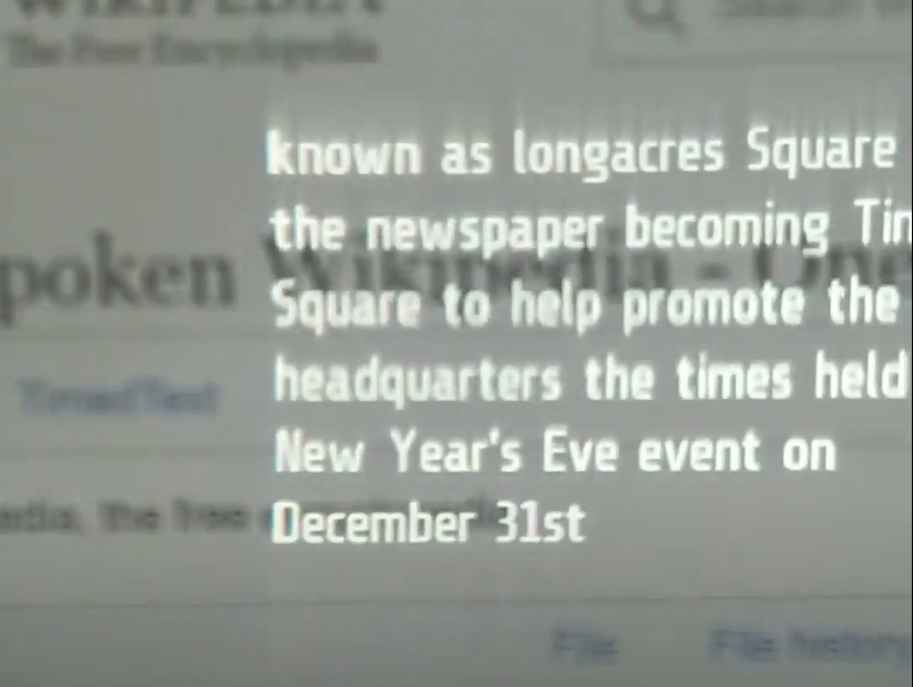
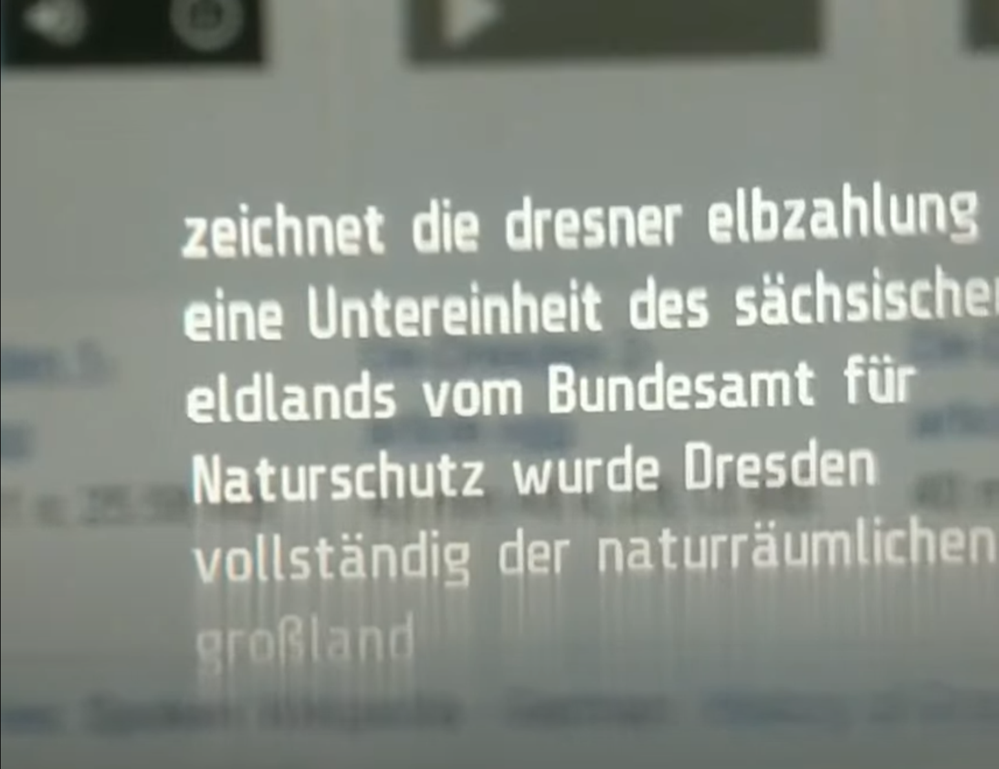
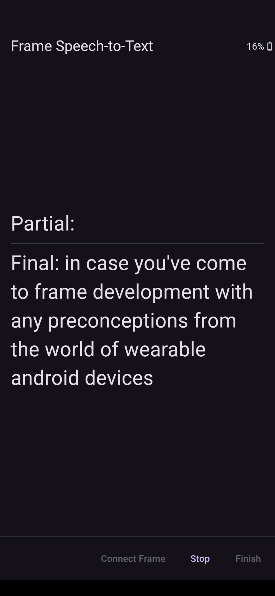
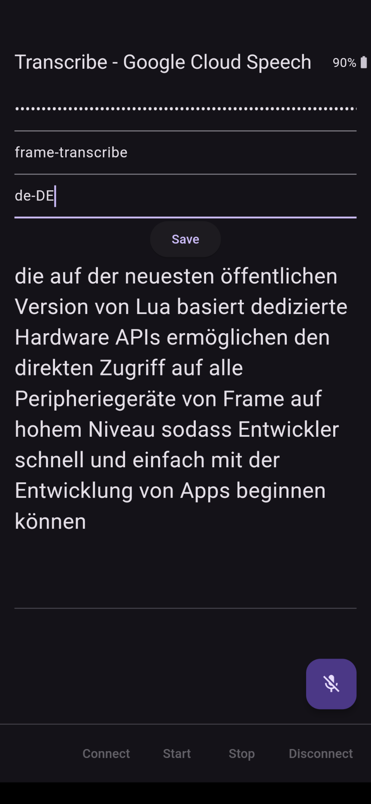

# Frame Transcribe - Google Cloud Speech API (online speech-to-text, live captioning, Frame microphone)

Connects to Brilliant Labs Frame, streams audio from the Frame microphone, which is sent through a [Google's cloud-based streaming transcription service](https://cloud.google.com/speech-to-text), and displays the streaming text on the Frame display in real-time.

Google's cloud-based speech-to-text streaming API [supports many languages](https://cloud.google.com/speech-to-text/v2/docs/speech-to-text-supported-languages), and this app presently uses the `telephony` model type.

Frame display however only shows Latin script in plain text, so for now this demonstration app is useful for a subset of those languages.

## Google Cloud API Setup

**NOTE:** At the time of writing, [Google provides 60 minutes of speech-to-text per month for free](https://cloud.google.com/speech-to-text/pricing) but a Google Cloud project must be set up with billing enabled and the Speech-to-Text API enabled. Google seems to reserve the right to use unbilled transcriptions for its training data, but not paid API usage, so as always consider what content you transmit.

* Follow [the instructions](https://cloud.google.com/speech-to-text/docs/before-you-begin) for setting up your own Google Cloud project with the Speech-to-Text API enabled (use v2)
* Create a "Service Account" for authorization and keep the JSON string handy to input into the corresponding text box in the app (only once - it will be persisted)
* Put your project-id in the corresponding text box in the app (e.g. `frame-transcribe`) - also persisted
* Put in a language code from the [supported languages list](https://cloud.google.com/speech-to-text/v2/docs/speech-to-text-supported-languages) (`telephony` models only, for now) e.g. `en-US` or `de-DE` keeping in mind the Latin-script-only restriction of the Frame display in plain text

### Frameshots

### Framecasts

https://github.com/user-attachments/assets/593bc473-377a-4e88-b77e-1c894c906939

https://github.com/user-attachments/assets/15d4e98b-54dd-4d4e-bd9a-99a47f81335f

### Screenshots

### Architecture

### See Also
- [Frame Speech-to-text (Phone Microphone)](https://github.com/CitizenOneX/frame_flutter_stt_host)
